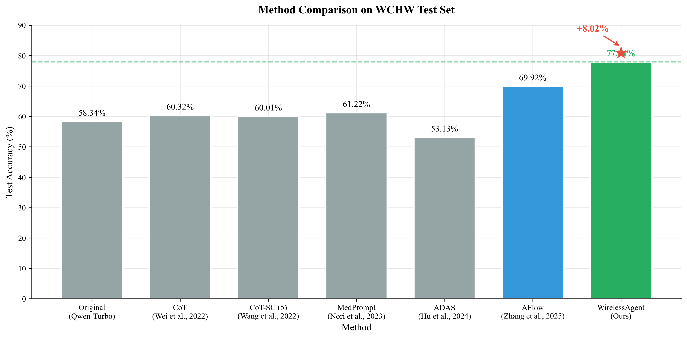
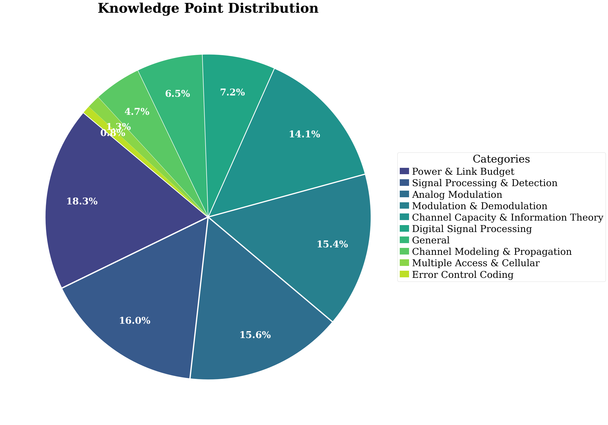
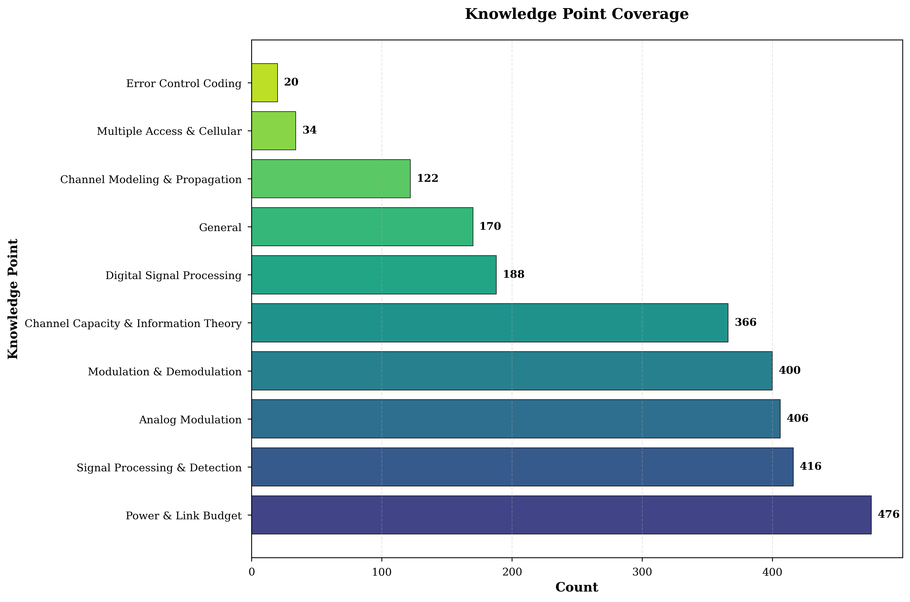
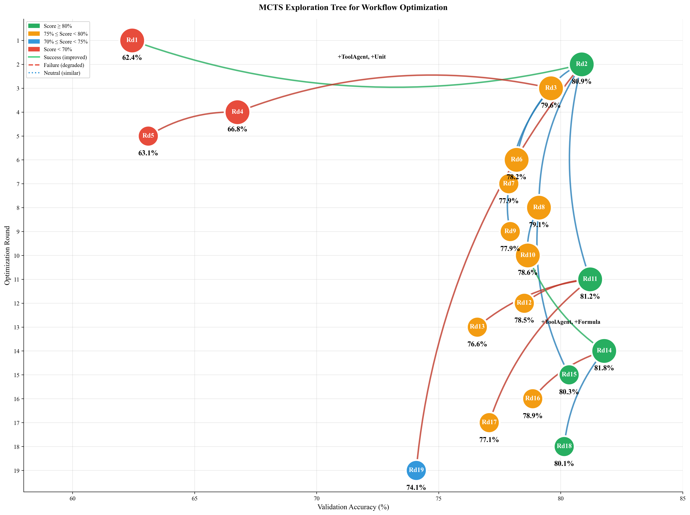
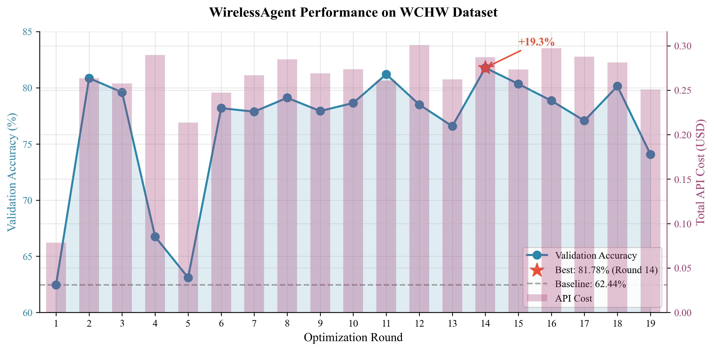
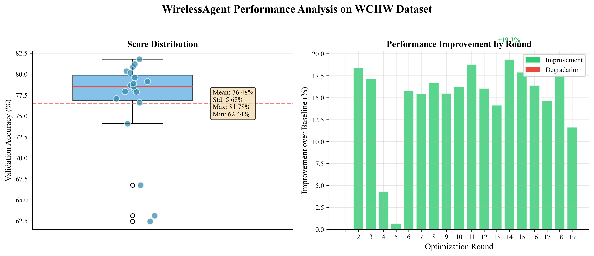

# WirelessAgent: LLM Agents for Wireless Communication Problems

**UC Berkeley AgentX Competition Benchmark Submission**

WirelessAgent is an automated LLM agent system for solving wireless communication homework problems (WCHW dataset). It uses Monte Carlo Tree Search (MCTS) to automatically discover and optimize agentic workflows for domain-specific problem solving.

## 🏆 Performance Highlights

<p align="center">
  
</p>

**WirelessAgent achieves 77.94% accuracy on the WCHW test set**, outperforming all baseline methods including AFlow (+7.0%), MedPrompt (+16.7%), and standard Chain-of-Thought (+17.6%).

---

## WCHW Dataset

### Overview

The **Wireless Communication Homework (WCHW)** dataset contains 349 validated problems and 100 test problems covering core wireless communication concepts:

<p align="center">
  
</p>

| Topic | Examples |
|-------|----------|
| Channel Capacity | Shannon capacity, SNR calculations |
| Modulation | ASK, PSK, QAM, FM/PM analysis |
| Coding | Linear block codes, parity bits |
| Signal Processing | Bandwidth, sampling, spectral efficiency |
| Propagation | Free-space loss, path loss models |
| Noise Analysis | BER, noise power, Q-function |

<p align="center">
  
</p>

### Data Format

Each problem is stored in JSONL format with the following structure:

```json
{
  "question": "Channel capacity with SNR=0.5 and bandwidth B=1 MHz. Compute C in Mbit/s.",
  "answer": "0.585 Mbit/s",
  "cot": "Step 1: C=B*log2(1+SNR)=1e6*log2(1.5)...",
  "id": "val_1"
}
```

### Answer Types

The dataset supports multiple answer types:

| Type | Example | Description |
|------|---------|-------------|
| Numeric with units | `16 kbit/s`, `44.8 kHz` | Values with SI units |
| Pure numeric | `1.54`, `4800` | Dimensionless numbers |
| Scientific notation | `5.42e-6`, `2.2×10^-8` | Large/small values |
| Mathematical formulas | `(A^2 T)/3`, `1/(2τ_0)` | Symbolic expressions |
| LaTeX expressions | `$s_{FM}(t)=3\cos...$` | Formatted equations |

---

## Evaluation Metrics

### Scoring Strategy

| Answer Type | Scoring Method | Thresholds |
|-------------|----------------|------------|
| **Numeric** | Relative error | <1%: 1.0, <5%: 0.9, <10%: 0.7 |
| **Scientific** | Relative error with unit normalization | Same as numeric |
| **Formula** | Symbolic matching after normalization | Exact: 1.0, Partial: 0.8 |
| **Text** | Keyword/phrase matching | >80% match: 1.0 |

### Unit Handling

The evaluator automatically handles unit conversions:

- **Frequency**: Hz, kHz, MHz, GHz
- **Data rate**: bps, kbit/s, Mbit/s, Gbps
- **Power**: W, mW, μW, dBm, dBW
- **Time**: s, ms, μs, ns
- **Distance**: m, km, cm, mm

### Final Score

The benchmark reports:
- **Average Score**: Mean accuracy across all problems (0.0 - 1.0)
- **Total Cost**: Cumulative LLM API cost
- **Per-problem Results**: CSV file with individual scores

---

## Quick Start

### 1. Environment Setup

```bash
# Create Python 3.9+ environment
conda create -n wirelessagent python=3.9
conda activate wirelessagent

# Install dependencies
pip install -r requirements.txt
```

### 2. Configure LLM

Edit `config/config2.yaml` with your API keys:

```yaml
models:
  gpt-4o-mini:
    api_key: "your-api-key"
    base_url: "https://api.openai.com/v1"
    temperature: 0.7
  
  claude-3-5-sonnet-20241022:
    api_key: "your-api-key"
    base_url: "https://api.anthropic.com/v1"
    temperature: 0.7
```

### 3. Run Optimization (Validation Set)

```bash
# Basic run
python run.py --dataset WCHW

# With custom parameters
python run.py --dataset WCHW \
    --sample 8 \
    --max_rounds 20 \
    --opt_model_name Claude-Opus-4.5 \
    --exec_model_name qwen-turbo-latest
```

### 4. Run Evaluation (Test Set)

```bash
python run.py --dataset WCHW --mode Test --test_rounds 14
```

---

## Command Line Options

| Parameter | Default | Description |
|-----------|---------|-------------|
| `--dataset` | Required | Dataset name (WCHW) |
| `--mode` | `Graph` | `Graph` for optimization, `Test` for evaluation |
| `--sample` | `4` | Number of workflows to sample per round |
| `--max_rounds` | `20` | Maximum optimization rounds |
| `--opt_model_name` | `claude-3-5-sonnet-20241022` | Model for workflow optimization |
| `--exec_model_name` | `gpt-4o-mini` | Model for problem execution |
| `--test_rounds` | `1` | Comma-separated round numbers for testing |
| `--check_convergence` | `True` | Enable early stopping |

---

## Project Structure

```
WirelessAgent/
├── run.py                      # Main entry point
├── config/config2.yaml         # LLM configuration
├── data/datasets/
│   ├── wchw_validate.jsonl     # 349 validation problems
│   └── wchw_test.jsonl         # 100 test problems
├── benchmarks/
│   ├── benchmark.py            # Base benchmark class
│   └── wchw.py                 # WCHW evaluation logic
├── scripts/
│   ├── optimizer.py            # MCTS workflow optimizer
│   ├── evaluator.py            # Evaluation orchestrator
│   ├── operators.py            # LLM operators (Custom, ToolAgent, etc.)
│   └── telecom_tools/          # Domain-specific tools
└── workspace/WCHW/workflows/   # Optimization results
```

---

## Results

### MCTS Optimization Process

WirelessAgent uses Monte Carlo Tree Search to explore and optimize agentic workflows:

<p align="center">
  
</p>

### Performance Evolution

The optimization converges to high-performing workflows over 10 rounds:

<p align="center">
  
</p>

### Validation Set Results

| Round | Score | Model |
|-------|-------|-------|
| Round 14 | **81.78%** | Claude + qwen-turbo-latest |
| Round 11 | 81.21% | Claude + qwen-turbo-latest |
| Round 2 | 80.86% | Claude + qwen-turbo-latest |

### Score Distribution Analysis

<p align="center">
  
</p>

### Test Set Comparison

Comparison with baseline methods on WCHW test set (100 problems):

| Method | Accuracy | Improvement |
|--------|----------|-------------|
| Original (Qwen-Turbo) | 58.34% | - |
| ADAS (Hu et al., 2024) | 53.13% | -5.21% |
| CoT-SC (Wang et al., 2022) | 60.01% | +1.67% |
| CoT (Wei et al., 2022) | 60.32% | +1.98% |
| MedPrompt (Nori et al., 2023) | 61.22% | +2.88% |
| AFlow (Zhang et al., 2025) | 69.92% | +11.58% |
| **WirelessAgent (Ours)** | **77.94%** | **+19.60%** |

---

## License

MIT License
